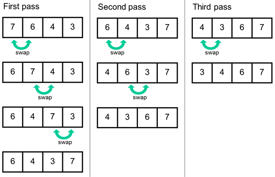
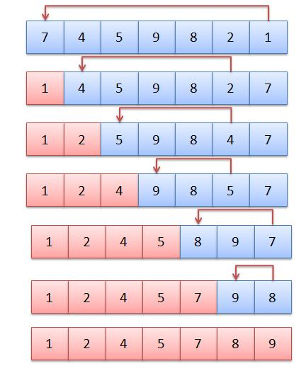
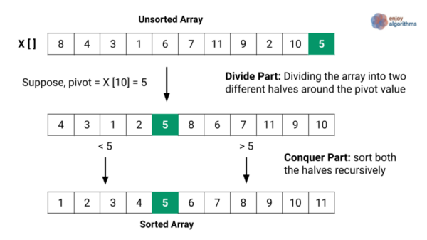
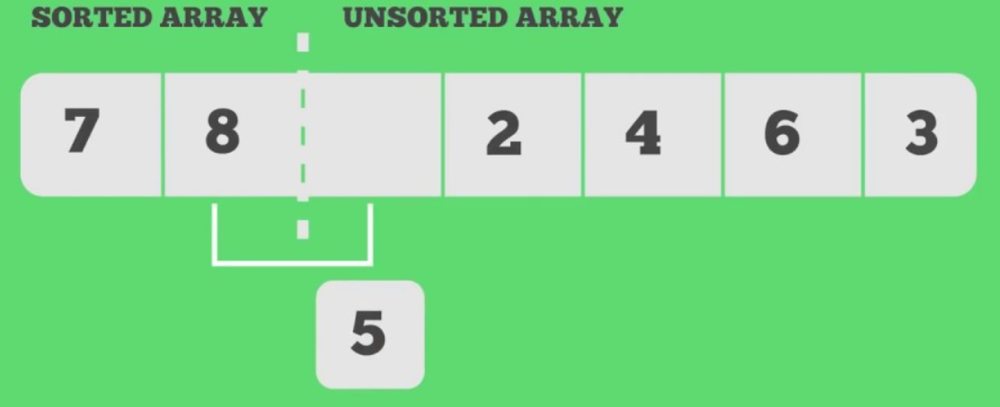

# ICG-SortingAlgorithms

Using threejs to show how some sorting algorithms work  
  
## Sorting Algorithms

Here we have a representation of some sorting algorithms  
  

## Bubble sort

 Bubble sort is a simple sorting algorithm where it compares every element to the next element.
 This is done until the array is sorted.

## Selection sort

The selection sort algorithm sorts an array by repeatedly finding the minimum element from unsorted part and putting it at the beginning.
For this algorithm we maintain two subarrays, one which is sorted and one which isn't.

1. Find the lowest element from the unsorted array
2. Put the lowest element in the sorted array next to the previous elements
3. This is done until the unsorted array is empty

## Quick sort

Quick sort picks an element as pivot and partitions the given array around the picked pivot.  

1. Chooses an element as pivot
2. Orders the rest of elements in two parts, one where every element is smaller than pivot and one where every element is bigger than pivot
3. Repeat this process for both parts until the array is sorted

## Insertion sort

Insertion sort splits the array into two parts, a sorted and an unsorted part. Values from the unsorted part are picked and placed at the correct position in the sorted part.

1. Iterate from the first element to the last one
2. Compare the current element (key) to its predecessor
3. If the key element is smaller than its predecessor, compare it to the elements before until you find its right position

